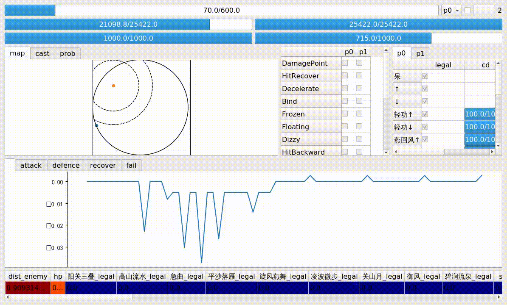

# Justice Online ([逆水寒](https://n.163.com))


This is a simulated game environment for the commercial game [Justice Online](https://n.163.com).
This environment is designed for training a game AI
since the resource requirement (e.g., memory usage, startup time) is much less than the original game,
and the game rules are designed as identical as possible with the original version.

# Install

* Make sure you are using a Linux system. Our code is tested on [Ubuntu 18.04](https://releases.ubuntu.com/18.04).
* Install the dependent libraries and tools from APT source:
```bash
apt install -y \
    build-essential cmake git aria2 rpl fakeroot alien \
    python3-dev python3-pip python3-wheel \
    lua-penlight lua-penlight-dev lua-filesystem-dev lua-cjson-dev lua-messagepack lua-compat53
```
* Install the dependent Python libraries: `pip3 install -r requirements.txt`.
* Install Lua (5.1.5 is tested) and LuaJIT (2.0.5 is tested).
The following commands can be used to compile and install from source code:
```bash
export VERSION=5.1.5 && \
	aria2c http://www.lua.org/ftp/lua-$VERSION.tar.gz --continue=true && \
	tar -xf lua-$VERSION.tar.gz && \
	cd lua-$VERSION && \
	rpl /usr/local $(pwd)/usr/local Makefile && \
	rpl "TO_LIB= liblua.a" "TO_LIB= liblua.a liblua.so" Makefile && \
	rpl "CFLAGS= -O2 -Wall" "CFLAGS=-fPIC -O2 -Wall" src/Makefile && \
	rpl -e "LUA_A=\tliblua.a" "LUA_A=\tliblua.a\nLUA_SO=\tliblua.so" src/Makefile && \
	rpl '$(LUA_T) $(LUAC_T)' '$(LUA_T) $(LUAC_T) $(LUA_SO)' src/Makefile && \
	rpl -e 'clean:' '$(LUA_SO): $(CORE_O) $(LIB_O)\n\t$(CC) -o $@ -shared $? -ldl -lm\n\nclean:' src/Makefile && \
	mkdir -p $(pwd)/usr/local && \
	make linux MYCFLAGS=-fPIC -j $(grep -c ^processor /proc/cpuinfo) && make install && \
	mv usr/local/lib/liblua.a usr/local/lib/liblua5.1.a && \
	mv usr/local/lib/liblua.so usr/local/lib/liblua5.1.so && \
	ln -s liblua5.1.so usr/local/lib/liblua5.1.so.0 && \
	tar -cf local-lua-$VERSION.tar.gz usr && \
	fakeroot alien local-lua-$VERSION.tar.gz && \
	dpkg -r local-lua; dpkg -i local-lua_$VERSION*.deb && \
	cd .. && \
	rm -rf lua-*

export VERSION=2.0.5 && \
	aria2c http://luajit.org/download/LuaJIT-$VERSION.tar.gz --continue=true && \
	tar -xf LuaJIT-$VERSION.tar.gz && \
	cd LuaJIT-$VERSION && \
	make install -j $(grep -c ^processor /proc/cpuinfo) DESTDIR=$(pwd) && \
	tar -cf local-luajit-$VERSION.tar.gz usr && \
	fakeroot alien local-luajit-$VERSION.tar.gz && \
	dpkg -r local-luajit; dpkg -i local-luajit_$VERSION*.deb && \
	cd .. && \
	rm -rf LuaJIT-*

export VERSION=3.2.1 && \
	aria2c http://luarocks.org/releases/luarocks-$VERSION.tar.gz --continue=true && \
	tar -xf luarocks-$VERSION.tar.gz && \
	cd luarocks-$VERSION && \
	./configure && make install -j $(grep -c ^processor /proc/cpuinfo) DESTDIR=$(pwd) && \
	tar -cf local-luarocks-$VERSION.tar.gz usr && \
	fakeroot alien local-luarocks-$VERSION.tar.gz && \
	dpkg -r local-luarocks; dpkg -i local-luarocks_$VERSION*.deb && \
	cd .. && \
	rm -rf luarocks-*
	
luarocks install luaposix
```
* Install [lunatic-python](https://github.com/bastibe/lunatic-python) and [lupa](https://github.com/scoder/lupa):
```bash
export VERSION_LUA=5.1 && \
	git clone https://github.com/bastibe/lunatic-python.git && \
	cd lunatic-python && \
	git checkout -f a4eae70f9095109a1ebc5ab8fa0c194d1e7eb937 && \
	rpl 2.7 3.6 CMakeLists.txt && \
	cd .. && \
	rm -rf lunatic-python-build && \
	mkdir lunatic-python-build && \
	cd lunatic-python-build && \
	cmake ../lunatic-python && \
	make -j $(grep -c ^processor /proc/cpuinfo) && \
	cd bin && \
	mkdir -p usr/local/lib/lua/$VERSION_LUA/python3.6 && \
	mv python.so usr/local/lib/lua/$VERSION_LUA/python3.6 && \
	mkdir -p usr/local/lib/python3.6/dist-packages && \
	mv lua.so usr/local/lib/python3.6/dist-packages && \
	tar -cf local-lunatic-1.0.tar.gz usr && \
	fakeroot alien local-lunatic-1.0.tar.gz && \
	dpkg -r local-lunatic; dpkg -i local-lunatic_*.deb && \
	cd ../../ && \
	rm -rf lunatic-python*

export VERSION=1.8 && \
	aria2c https://github.com/scoder/lupa/archive/lupa-$VERSION.tar.gz --continue=true && \
	pip3 wheel lupa-lupa-$VERSION.tar.gz && \
	pip3 install lupa-$VERSION-*.whl && \
	rm lupa-*
```
* Extract Lua binaries of Justice Online:
```bash
mkdir -p ~/netease/nsh/server
VERSION=19-10-16-12-00
tar -xf $VERSION.tar.gz -C ~/netease/nsh/server/
cd ~/netease/nsh/server/
ln -s $VERSION default
echo "export NSH_SERVER=~/netease/nsh/server/default" >> ~/.profile
```
* Logout and re-login the user to make the environment variable `$NSH_SERVER` effective.

# Using an interactive GUI tool

To test if the simulated game environment is properly installed, you can startup an interactive GUI tool by typing:
```bash
killall -9 luajit
python3 netease/nsh/play.py -m nsh/full_power=0
```
Here, the `-m nsh/full_power=0` argument is used to run this game with a normal speed.
You may use the keyboard (the default key mapping config file is `netease/nsh/config/relative.tsv`) to control the player 0 fight against a rule-based opponent.
Here is an example:


# Author

* 申瑞珉 (Ruimin Shen)